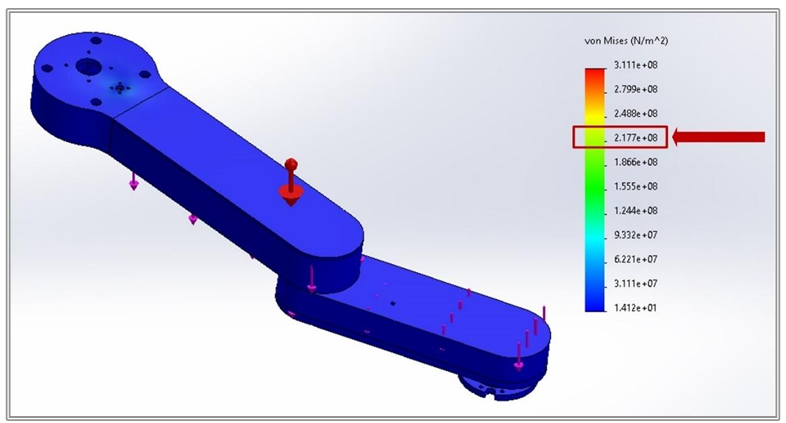
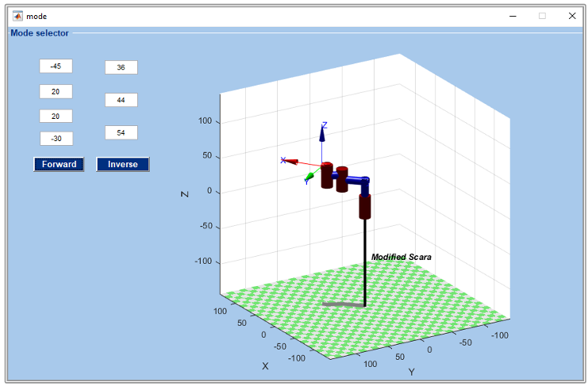

# 4DOF SCARA Robot for Automated Object Sorting
*A graduation project combining robotics, machine vision, and embedded systems.*  
|   
| *Figure: SCARA Design*  

|  |  |
|:--------------------------------------------------:|:-----------------------------------------------:|
| *Figure: SCARA Design*                         | *Figure: Matlab simulation*              |

GUI Implemented using MegunoLink to send/recieve data using USB serial communication with Arduino:
| 
| *Figure: MegunoLink


## 📌 Project Overview
- **Goal**: Design a 4DOF SCARA robot to sort objects by color/shape using machine vision.
- **Key Features**:
  - Modified SCARA structure with 40 cm workspace radius.
  - Computer vision (OpenCV) for object pose detection.
  - MATLAB-based kinematics solver and GUI.
  - Optimized mechanical design (PLA+ parts, stress-tested).
- **Technologies**: SOLIDWORKS, MATLAB, OpenCV, Tiva C, A4988 drivers.

## 🔧 Key Components (From Report)
| **Mechanical**              | **Electrical/Embedded**      |
|------------------------------|------------------------------|
| 3D-printed PLA+ arms         | Tiva C microcontroller       |
| GT2 timing belts/pulleys     | NEMA 17 stepper motors       |
| Linear guides (10mm)         | KY-040 rotary encoders       |
| Lead screw (8mm, 400mm)      | A4988 stepper drivers        |
| MG996R servo (11 kg.cm grip) | Limit switches              |

## 🎯 Technical Highlights
### Kinematics & Control
- **DH Parameters**:  
    
  ```matlab
  % MATLAB Forward Kinematics Code (From Report)
  L(1) = Link([0 35.8 0 pi 0], 'standard');
  Rb = SerialLink(L);
  T = Rb.fkine([th1 d2 th3 th4]);

  % Inverse Kinematics Solution:
  \theta_1 = \arctan(x/y) - \arctan\left(\frac{L_2 \sin(\theta_2)}{L_1 + L_2 \cos(\theta_2)}\right)
  ```

## Machine Vision Pipeline
- Camera: ASUS C3 (1080p, 30 fps).
- Detection: OpenCV for color/shape recognition (planned for Semester 2).

## 🛠️ Skills Demonstrated
- Robotics: DH parameterization, torque/stress analysis, trajectory planning.
- Embedded Systems: Motor control (steppers/servos), sensor integration.
- Software: MATLAB GUI, OpenCV (Python), SOLIDWORKS simulations.

